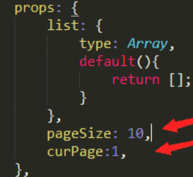

# my_game

### 主页-MyGame

#### header

技术点

backdrop-filter blur(): 对后面的元素造成模糊效果, 自身背景透明度不能为1

background-clip text: 设置文字为transparent, 会形成花体字效果

#### left-container

注意 

在css中background-image的url使用相对路径可以直接写; 

background-image url(assets/images/pikachu_03.jpg)

如果使用绝对路径(配合别名), 就要写成如下形式

background-image url('~assets/images/paper.jpg')

#### right-container

问题:

##### VUE动态绑定video或者audio的src不成功

在data里写数据, 用:src绑定, 不可行

 在mouted钩子中, this.$refs.video.src = 你自己的视频地址 ,  不可行

一直是这个样子


(可怕的是, 网上n多篇文章都是这样说的)

直接在标签中写src = "./派对动物-五月天.mp3"

然而在控制台中看是这样子的...src="/media/派对动物-五月天.3038eecc.mp3"

后知后觉明白过来 音频根本没有加载 地址是错的 用第二个地址动态赋值就可以了...卧槽 太坑了吧, 而且, 换另一首歌后面跟的就不是.3038eecc了...

**总算找到靠谱的!!!**

```kotlin
 //动态加载需要使用require,否则会将数据转换成字符串类型
 (data中) audioSrc: require('./派对动物-五月天.mp3')
```

也就是 音频地址 是会被转换为字符串的, 写在标签里是数据, 后被转换为字符串; 动态赋值直接是字符串, 需要使用require引入数据

在 webpack 中，我们发现，在项目中直接把图片(包括音频)路径拿过来使用是行不通的，要在 require 或者 import 引入之后才能使用这些资源。这是因为 webpack 会把图片当作模块来使用，而不是直接以字符串的形式(模块化是 node 编程的核心理念之一) 

##### 模块

commonjs exports与require

module.exports.lrcStr = 

let {lrcStr} = require('./resources/派对动物-五月天lrc')

es6 export与import

import 与 require

import只能在开头使用 require可以在任何地方使用


##### 获取元素时 尽量不要用dom方法, 而用ref

   // let lis = document.querySelectorAll('.lrcLine')

   let lis = this.$refs.lrcLineRef

不知道为什么 timeupdate中用上面方法获取时, 只有第一次是获取到的, 之后都是空数组

傻了呀 因为后面把class设置为'', 自然获取不到元素了

给v-for元素和非v-for元素设置一样的ref, 只能获取到v-for元素, why

【歌词/歌单切换】有的时候虽然是互斥显示 但是也不能用v-if 和v-else, 而是要用两个v-show, 值取反; 因为需要拿到渲染出来的元素进行操作, 而且两者之前的切换也频繁


#### blocks

##### vue中 页面刷新之后，拿不到store中的数据

我是在一个组件(位于首页)的created钩子将数据提交到store.state 然后在另一个组件中使用(位于block页); 第一次进入是ok的, 但是当我刷新block页时, 就拿不到数据了

这是因为 `store`是用来存储组件状态的，不是用来做本地数据存储的。 页面刷新之后store回到初始状态了，但是刷新block页的时候， 首页的那个组件并没有创建， 也就没有赋值， vuex中便没有数据

js代码是运行在内存中的， 代码运行时的所有变量， 函数， 也都是保存在内存中的。刷新页面， 以前申请的内存被释放， 重新加载脚本代码， 变量重新赋值， 所以这些数据要想储存就必须储存在外部， 例如： localStorage, sessionStorage, IndexDB等

**如果使用<keep-alive><router-view/></keep-alive>, 视图的子组件也有actived/deactived钩子, 这两个钩子是交替执行, 不能一遍一遍的执行某一个, 所以我尝试用deactived钩子来提交数据到store.state, 也是行不通的, 目前看来只能用外部存储


##### Right-hand side of ‘instanceof’ is not an object

该错误说明在需要是object的地方 不是object; 比如:




使用ref获取组件时, 如果多个组件有同样的ref, 则只能获取到最后一个; 我真正是想要获取组件内的元素, 那么这个时候querySelector就派上用场了


##### 点击a标签时，页面整体上移

 \#可用作锚点进行页面定位  它不在乎视图 而是相对于渲染出来的整个页面; 即使是一个嵌套在内部的div中设置了锚点 都会将整个页面上移到能看到整个页面的底部


vue中可以在子组件上加class 渲染的时候会加入到一起 **但是**

【class同样的属性】在父组件里为子组件设置的会被子组件内部设置的覆盖

##### frontend

RangeError: Maximum call stack size exceeded

在组件中调用自身会造成此错误

##### language

载入组件时, 先触发created钩子, 然后是watch方法, 就很奇怪, 这个时候数据怎么变化了

